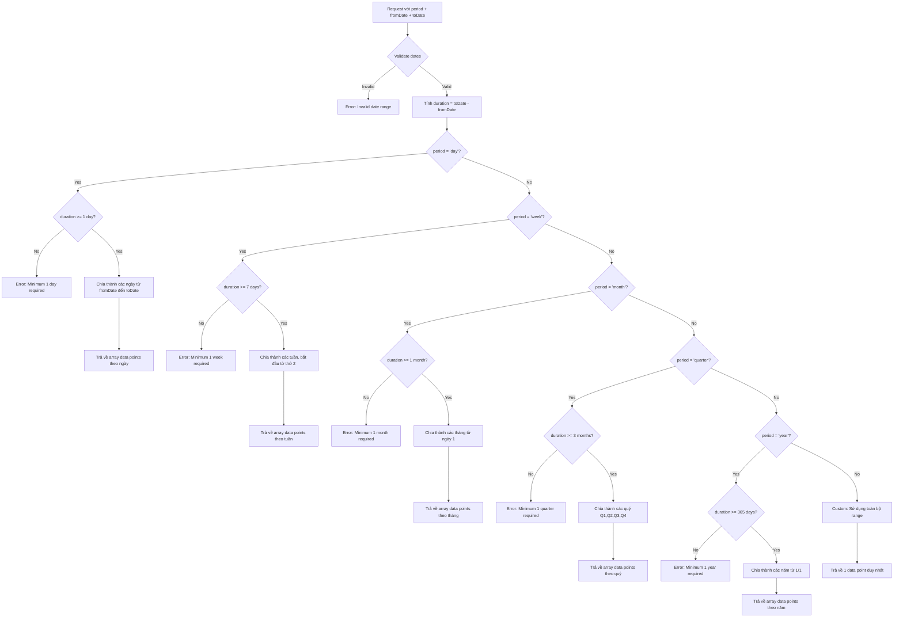
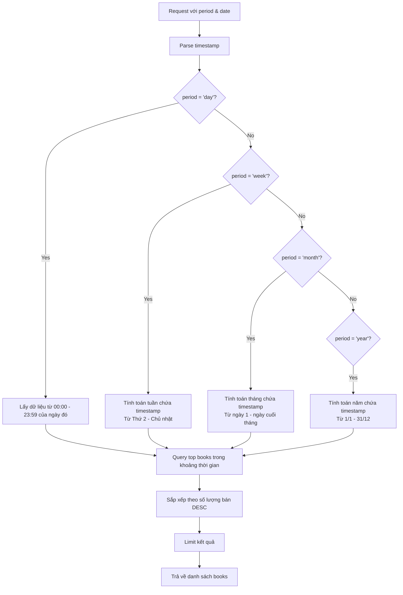
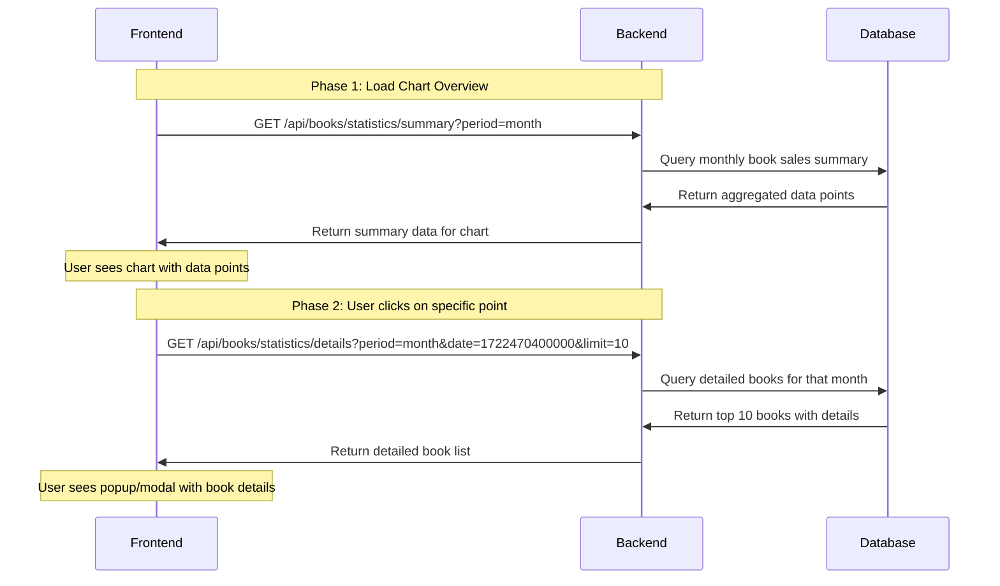
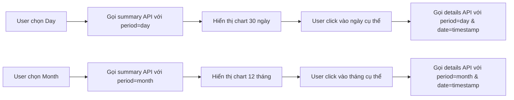

# 📊 Tài liệu API Thống kê Sách - Book Statistics

## Tổng quan

Hệ thống thống kê sách được thiết kế với 2 tầng (tier) để tối ưu hiệu năng:

- **Tier 1 (Summary)**: Dữ liệu tổng quan nhẹ cho biểu đồ
- **Tier 2 (Details)**: Chi tiết khi user click vào điểm cụ thể

## 1. API Thống kê Tổng quan (Tier 1)

### 📍 Endpoint
```
GET /api/books/statistics/summary
```

### 🎯 Mục đích
Trả về dữ liệu nhẹ cho chart overview - chỉ tổng số sách bán theo thời gian

### 📥 Parameters

| Parameter | Type | Required | Default | Description |
|-----------|------|----------|---------|-------------|
| period | String | No | "day" | Loại khoảng thời gian |
| fromDate | Long | No | null | Timestamp bắt đầu (milliseconds) |
| toDate | Long | No | null | Timestamp kết thúc (milliseconds) |

### 🔧 Quy tắc Period và Date Range

#### Period Types
- **day**: Thống kê theo ngày
- **week**: Thống kê theo tuần  
- **month**: Thống kê theo tháng
- **quarter**: Thống kê theo quý
- **year**: Thống kê theo năm
- **custom**: Khoảng thời gian tùy chỉnh

### 🔍 Chi tiết xử lý fromDate-toDate với Period

Khi có `fromDate` và `toDate`, hệ thống sẽ:
1. **Validate khoảng thời gian hợp lệ** 
2. **Chia khoảng thời gian theo period**
3. **Kiểm tra độ dài tối thiểu cho mỗi period**
4. **Trả về data points hoặc error**

#### 🎯 Logic xử lý từng Period Type

#### Luồng xử lý Date Range



### 📊 Chi tiết xử lý từng loại Period

#### 1️⃣ PERIOD = "day"
```javascript
// Input: fromDate=1722470400000 (2025-08-01), toDate=1722816000000 (2025-08-05)
// Duration: 4 ngày
// Expected output: 4 data points

[
  {
    "period": "2025-08-01",
    "timestamp": 1722470400000,
    "startTime": 1722470400000,  // 2025-08-01 00:00:00
    "endTime": 1722556799999,    // 2025-08-01 23:59:59
    "totalBooksSold": 45,
    "totalRevenue": 1250000
  },
  {
    "period": "2025-08-02", 
    "timestamp": 1722556800000,
    "startTime": 1722556800000,  // 2025-08-02 00:00:00
    "endTime": 1722643199999,    // 2025-08-02 23:59:59
    "totalBooksSold": 32,
    "totalRevenue": 980000
  },
  // ... tiếp tục cho 2025-08-03, 2025-08-04
]

// ❌ CASE LỖI: fromDate=1722470400000, toDate=1722480000000 (chỉ 2.7 giờ)
{
  "status": 400,
  "message": "Period 'day' requires minimum 1 day duration. Current: 2.7 hours",
  "data": null,
  "minDurationRequired": "1 day",
  "actualDuration": "2.7 hours"
}
```

#### 2️⃣ PERIOD = "week"
```javascript
// Input: fromDate=1722470400000 (2025-08-01 Fri), toDate=1724889600000 (2025-08-29 Fri) 
// Duration: 28 ngày = 4 tuần
// Expected output: 4 data points (tuần bắt đầu từ thứ 2)

[
  {
    "period": "2025-W31",               // Tuần 31 năm 2025
    "timestamp": 1722297600000,         // Monday của tuần đó
    "startTime": 1722297600000,         // 2025-07-29 00:00:00 (Monday)
    "endTime": 1722902399999,           // 2025-08-04 23:59:59 (Sunday)
    "totalBooksSold": 124,
    "totalRevenue": 3450000,
    "daysInPeriod": 7,
    "partialWeek": true                 // Vì fromDate không phải thứ 2
  },
  {
    "period": "2025-W32",
    "timestamp": 1722902400000,         // 2025-08-05 00:00:00 
    "startTime": 1722902400000,         // 2025-08-05 00:00:00 (Monday)
    "endTime": 1723507199999,           // 2025-08-11 23:59:59 (Sunday)
    "totalBooksSold": 156,
    "totalRevenue": 4120000,
    "daysInPeriod": 7,
    "partialWeek": false                // Tuần đầy đủ
  },
  // ... W33, W34
]

// ❌ CASE LỖI: fromDate=1722470400000, toDate=1722902400000 (5 ngày)
{
  "status": 400,
  "message": "Period 'week' requires minimum 7 days duration. Current: 5 days",
  "data": null,
  "minDurationRequired": "7 days",
  "actualDuration": "5 days",
  "suggestion": "Use period='day' for shorter durations"
}
```

#### 3️⃣ PERIOD = "month"
```javascript
// Input: fromDate=1722470400000 (2025-08-01), toDate=1730419200000 (2025-11-01)
// Duration: 3 tháng 
// Expected output: 3 data points

[
  {
    "period": "2025-08",
    "timestamp": 1722470400000,         // 2025-08-01 00:00:00
    "startTime": 1722470400000,         // 2025-08-01 00:00:00  
    "endTime": 1725148799999,           // 2025-08-31 23:59:59
    "totalBooksSold": 892,
    "totalRevenue": 25600000,
    "daysInPeriod": 31
  },
  {
    "period": "2025-09",
    "timestamp": 1725148800000,         // 2025-09-01 00:00:00
    "startTime": 1725148800000,         // 2025-09-01 00:00:00
    "endTime": 1727827199999,           // 2025-09-30 23:59:59  
    "totalBooksSold": 756,
    "totalRevenue": 22100000,
    "daysInPeriod": 30
  },
  {
    "period": "2025-10", 
    "timestamp": 1727827200000,         // 2025-10-01 00:00:00
    "startTime": 1727827200000,         // 2025-10-01 00:00:00
    "endTime": 1730419199999,           // 2025-10-31 23:59:59
    "totalBooksSold": 623,
    "totalRevenue": 18900000,
    "daysInPeriod": 31
  }
]

// ❌ CASE LỖI: fromDate=2025-08-01, toDate=2025-08-15 (15 ngày)
{
  "status": 400,
  "message": "Period 'month' requires minimum 1 month duration. Current: 15 days", 
  "data": null,
  "minDurationRequired": "30 days",
  "actualDuration": "15 days",
  "suggestion": "Use period='day' or extend date range to at least 30 days"
}
```

#### 4️⃣ PERIOD = "quarter" 
```javascript
// Input: fromDate=1704067200000 (2024-01-01), toDate=1735689600000 (2025-01-01)
// Duration: 1 năm = 4 quý
// Expected output: 4 data points

[
  {
    "period": "2024-Q1",
    "timestamp": 1704067200000,         // 2024-01-01 00:00:00
    "startTime": 1704067200000,         // 2024-01-01 00:00:00
    "endTime": 1711929599999,           // 2024-03-31 23:59:59
    "totalBooksSold": 2156,
    "totalRevenue": 65400000,
    "monthsInPeriod": 3,
    "months": ["Jan", "Feb", "Mar"]
  },
  {
    "period": "2024-Q2", 
    "timestamp": 1711929600000,         // 2024-04-01 00:00:00
    "startTime": 1711929600000,         // 2024-04-01 00:00:00
    "endTime": 1719791999999,           // 2024-06-30 23:59:59
    "totalBooksSold": 1987,
    "totalRevenue": 58900000,
    "monthsInPeriod": 3,
    "months": ["Apr", "May", "Jun"]
  },
  // ... Q3, Q4
]

// ❌ CASE LỖI: fromDate=2025-01-01, toDate=2025-02-28 (2 tháng)
{
  "status": 400,
  "message": "Period 'quarter' requires minimum 3 months duration. Current: 2 months",
  "data": null,
  "minDurationRequired": "90 days",
  "actualDuration": "58 days", 
  "suggestion": "Use period='month' or extend date range to at least 90 days"
}
```

#### 5️⃣ PERIOD = "year"
```javascript
// Input: fromDate=1672531200000 (2023-01-01), toDate=1735689600000 (2025-01-01)  
// Duration: 2 năm
// Expected output: 2 data points

[
  {
    "period": "2023",
    "timestamp": 1672531200000,         // 2023-01-01 00:00:00
    "startTime": 1672531200000,         // 2023-01-01 00:00:00  
    "endTime": 1704067199999,           // 2023-12-31 23:59:59
    "totalBooksSold": 8956,
    "totalRevenue": 245600000,
    "daysInPeriod": 365,
    "isLeapYear": false
  },
  {
    "period": "2024",
    "timestamp": 1704067200000,         // 2024-01-01 00:00:00
    "startTime": 1704067200000,         // 2024-01-01 00:00:00
    "endTime": 1735689599999,           // 2024-12-31 23:59:59
    "totalBooksSold": 9234,
    "totalRevenue": 267800000,
    "daysInPeriod": 366,
    "isLeapYear": true
  }
]

// ❌ CASE LỖI: fromDate=2025-01-01, toDate=2025-11-01 (10 tháng)
{
  "status": 400,
  "message": "Period 'year' requires minimum 12 months duration. Current: 10 months",
  "data": null,
  "minDurationRequired": "365 days",
  "actualDuration": "304 days",
  "suggestion": "Use period='quarter' or period='month', or extend date range to at least 365 days"
}
```

### 🚨 Các trường hợp đặc biệt và Error Handling

#### Case 1: Không đủ đơn vị thời gian
```javascript
// Request: period=week, fromDate=2025-08-01, toDate=2025-08-05 (5 ngày)
{
  "status": 400,
  "message": "Period 'week' requires minimum 7 days. Current range is only 5 days",
  "data": null,
  "details": {
    "requestedPeriod": "week",
    "minDurationRequired": "7 days",
    "actualDuration": "5 days",
    "fromDate": "2025-08-01T00:00:00Z",
    "toDate": "2025-08-05T00:00:00Z",
    "suggestions": [
      "Extend toDate to at least 2025-08-08",
      "Use period='day' for shorter durations"
    ]
  }
}
```

#### Case 2: Khoảng thời gian lẻ - không chia đều
```javascript
// Request: period=month, fromDate=2025-08-15, toDate=2025-11-10 (2.8 tháng)
// System sẽ chia thành các tháng và xử lý tháng đầu/cuối bị cắt

[
  {
    "period": "2025-08",
    "timestamp": 1723680000000,         // 2025-08-15 00:00:00 (startTime actual)
    "startTime": 1723680000000,         // 2025-08-15 00:00:00 (không phải ngày 1)
    "endTime": 1725148799999,           // 2025-08-31 23:59:59
    "totalBooksSold": 456,              // Chỉ tính từ 15/8
    "totalRevenue": 12800000,
    "daysInPeriod": 17,                 // 17 ngày (không phải 31)
    "isPartialPeriod": true,
    "partialInfo": {
      "type": "start_partial",
      "missingDays": 14                 // Thiếu 14 ngày đầu tháng
    }
  },
  {
    "period": "2025-09", 
    "timestamp": 1725148800000,         // 2025-09-01 00:00:00
    "startTime": 1725148800000,         // 2025-09-01 00:00:00
    "endTime": 1727827199999,           // 2025-09-30 23:59:59
    "totalBooksSold": 789,              // Tháng đầy đủ
    "totalRevenue": 22100000,
    "daysInPeriod": 30,
    "isPartialPeriod": false
  },
  {
    "period": "2025-10",
    "timestamp": 1727827200000,         // 2025-10-01 00:00:00  
    "startTime": 1727827200000,         // 2025-10-01 00:00:00
    "endTime": 1728518399999,           // 2025-10-10 23:59:59 (không phải 31)
    "totalBooksSold": 234,              // Chỉ tính đến 10/10
    "totalRevenue": 6700000,
    "daysInPeriod": 10,                 // 10 ngày (không phải 31)
    "isPartialPeriod": true,
    "partialInfo": {
      "type": "end_partial", 
      "missingDays": 21                 // Thiếu 21 ngày cuối tháng
    }
  }
]
```

#### Case 3: Không có dữ liệu trong khoảng thời gian
```javascript
// Các data point vẫn được trả về nhưng với giá trị 0
[
  {
    "period": "2025-08-01",
    "timestamp": 1722470400000,
    "totalBooksSold": 0,               // Không có đơn hàng
    "totalRevenue": 0,
    "totalOrders": 0,
    "hasData": false                   // Flag để frontend biết
  }
]
```

#### Case 4: fromDate > toDate
```javascript
{
  "status": 400,
  "message": "fromDate must be less than toDate",
  "data": null,
  "details": {
    "fromDate": "2025-08-10T00:00:00Z",
    "toDate": "2025-08-05T00:00:00Z",
    "difference": "-5 days"
  }
}
```

#### Case 5: Khoảng thời gian quá lớn
```javascript
// Request: period=day, fromDate=2020-01-01, toDate=2025-12-31 (6 năm = 2191 data points)
{
  "status": 400,
  "message": "Date range too large for period 'day'. Maximum 365 data points allowed",
  "data": null,
  "details": {
    "requestedDataPoints": 2191,
    "maxDataPointsAllowed": 365,
    "suggestion": "Use period='week' or 'month' for longer date ranges"
  }
}
```

### 📏 Giới hạn số lượng data points

| Period | Max Data Points | Max Duration | 
|--------|-----------------|--------------|
| day | 365 | 1 năm |
| week | 104 | 2 năm | 
| month | 60 | 5 năm |
| quarter | 40 | 10 năm |
| year | 20 | 20 năm |

### 📤 Response Format

```json
{
  "status": 200,
  "message": "Thống kê tổng quan thành công",
  "data": [
    {
      "period": "2025-08-01",          // Nhãn thời gian
      "timestamp": 1722470400000,      // Timestamp để details API
      "totalBooksSold": 150,           // Tổng số sách bán
      "totalRevenue": 2500000,         // Tổng doanh thu (optional)
      "totalOrders": 45                // Tổng số đơn hàng (optional)
    },
    {
      "period": "2025-08-02",
      "timestamp": 1722556800000,
      "totalBooksSold": 200,
      "totalRevenue": 3200000,
      "totalOrders": 62
    }
  ]
}
```

### 🔥 Ví dụ sử dụng

#### 1. Thống kê 30 ngày gần nhất
```http
GET /api/books/statistics/summary?period=day
```

#### 2. Thống kê 12 tháng gần nhất  
```http
GET /api/books/statistics/summary?period=month
```

#### 3. Thống kê khoảng thời gian tùy chỉnh
```http
GET /api/books/statistics/summary?period=custom&fromDate=1722470400000&toDate=1725148800000
```

---

## 2. API Thống kê Chi tiết (Tier 2)

### 📍 Endpoint
```
GET /api/books/statistics/details
```

### 🎯 Mục đích
Trả về top sách chi tiết khi user click vào điểm cụ thể trên chart

### 📥 Parameters

| Parameter | Type | Required | Default | Description |
|-----------|------|----------|---------|-------------|
| period | String | Yes | - | Loại khoảng thời gian (day/week/month/year) |
| date | Long | Yes | - | Timestamp đại diện cho khoảng thời gian |
| limit | Integer | No | 10 | Số lượng sách muốn lấy |

### 🔧 Quy tắc xử lý Period và Date

#### Luồng xử lý



### 📤 Response Format

```json
{
  "status": 200,
  "message": "Lấy chi tiết thống kê thành công",
  "data": [
    {
      "bookId": 101,
      "bookName": "Sách A",
      "bookCode": "BOOK001",
      "coverImage": "image_url",
      "price": 150000,
      "discountPrice": 120000,
      "quantitySold": 25,
      "revenue": 3000000,
      "orderCount": 15,
      "categoryName": "Văn học",
      "authorName": "Tác giả A"
    },
    {
      "bookId": 102,
      "bookName": "Sách B", 
      "bookCode": "BOOK002",
      "coverImage": "image_url",
      "price": 200000,
      "discountPrice": 180000,
      "quantitySold": 20,
      "revenue": 3600000,
      "orderCount": 12,
      "categoryName": "Khoa học",
      "authorName": "Tác giả B"
    }
  ]
}
```

### 🔥 Ví dụ sử dụng

#### 1. Chi tiết top 10 sách bán chạy trong ngày 01/08/2025
```http
GET /api/books/statistics/details?period=day&date=1722470400000&limit=10
```

#### 2. Chi tiết top 5 sách bán chạy trong tháng 8/2025
```http
GET /api/books/statistics/details?period=month&date=1722470400000&limit=5
```

#### 3. Chi tiết top 20 sách bán chạy trong tuần chứa ngày 15/08/2025
```http
GET /api/books/statistics/details?period=week&date=1723680000000&limit=20
```

---

## 3. Luồng tương tác Frontend - Backend

### 📈 Kịch bản sử dụng điển hình



### 🔄 Luồng chuyển đổi Period



---

## 4. Quy tắc Business Logic

### 📊 Tính toán Period Range

#### Day Period
- **Summary**: Lấy 30 ngày gần nhất từ hôm nay
- **Details**: Từ 00:00:00 đến 23:59:59 của ngày được chọn

#### Week Period  
- **Summary**: Lấy 12 tuần gần nhất từ tuần hiện tại
- **Details**: Từ Thứ 2 00:00:00 đến Chủ nhật 23:59:59 của tuần chứa timestamp

#### Month Period
- **Summary**: Lấy 12 tháng gần nhất từ tháng hiện tại  
- **Details**: Từ ngày 1 00:00:00 đến ngày cuối tháng 23:59:59

#### Year Period
- **Summary**: Lấy 5 năm gần nhất từ năm hiện tại
- **Details**: Từ 1/1 00:00:00 đến 31/12 23:59:59

#### Custom Period
- **Summary**: Sử dụng fromDate và toDate được cung cấp
- **Details**: Không áp dụng (custom chỉ dùng cho summary)

### 🔄 Validation Rules

#### Summary API
1. Nếu `period = "custom"` → `fromDate` và `toDate` bắt buộc
2. `fromDate` phải < `toDate` 
3. Khoảng cách tối đa: 2 năm
4. Default period = "day" nếu không cung cấp

#### Details API  
1. `period` và `date` bắt buộc
2. `period` không được là "custom"
3. `limit` trong khoảng 1-100
4. `date` phải là timestamp hợp lệ

---

## 5. Performance & Caching

### 🚀 Tối ưu hiệu năng

#### Summary API
- Cache kết quả 15 phút cho period cố định (day, week, month, year)
- Custom period không cache
- Sử dụng Redis cache với key pattern: `book_stats_summary_{period}_{hash}`

#### Details API  
- Cache kết quả 5 phút 
- Cache key pattern: `book_stats_details_{period}_{date}_{limit}`
- Invalidate cache khi có order mới được confirm

### 📝 Logging & Monitoring

#### Key Metrics
- API response time
- Cache hit/miss rate  
- Number of data points returned
- Top requested periods
- Error rates by period type

---

## 6. Error Handling

### ❌ Các lỗi thường gặp

#### Summary API
```json
// Custom period thiếu date range
{
  "status": 400,
  "message": "Custom period requires fromDate and toDate",
  "data": null
}

// Date range không hợp lệ  
{
  "status": 400,
  "message": "fromDate must be less than toDate",
  "data": null
}

// Khoảng cách quá lớn
{
  "status": 400, 
  "message": "Date range cannot exceed 2 years",
  "data": null
}
```

#### Details API
```json
// Thiếu required parameters
{
  "status": 400,
  "message": "period and date are required",
  "data": null
}

// Period không hợp lệ
{
  "status": 400,
  "message": "period must be one of: day, week, month, year", 
  "data": null
}

// Limit vượt quá giới hạn
{
  "status": 400,
  "message": "limit must be between 1 and 100",
  "data": null
}
```

--- 